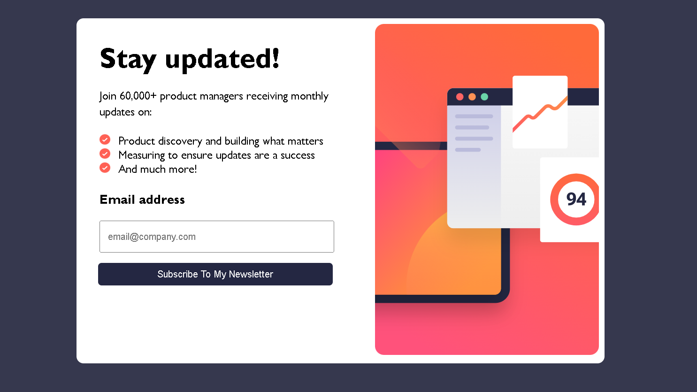

# Newsletter sign-up form with success message solution

A newsletter sign up form with a success page

## Table of contents

- [Overview](#overview)
  - [Features](#Features)
  - [Demo](#Demo)
  - [Links](#links)
  - [Built with](#built-with)
- [Acknowledgments](#acknowledgments)

## Overview

This is a solution to the [Newsletter sign-up form with success message challenge on Frontend Mentor](https://www.frontendmentor.io/challenges/newsletter-signup-form-with-success-message-3FC1AZbNrv). 

### Features

Users are able to:

- Add their email and submit the form
- See a success message with their email after successfully submitting the form
- See form validation messages if:
  - The field is left empty
  - The email address is not formatted correctly
- View the optimal layout for the interface depending on their device's screen size
- See hover and focus states for all interactive elements on the page

### Demo

### Links

- Live Site URL: [Add live site URL here](https://your-live-site-url.com)

### Built with

- Semantic HTML5 markup
- CSS custom properties
- Flexbox
- CSS Grid
- Mobile-first workflow
- Javascript
- [Styled Components](https://styled-components.com/) - For styles

##
- Website - [Taiwo Onileowo](https://www.your-site.com)
- Linkedin- [@Taiwo Onileowo](https://www.linkedin.com/in/taiwo-onileowo/)
- Github-   [@TaiwoOnileowo](https://www.github.com/TaiwoOnileowo/Newsletter-sign-up
## Acknowledgments

- @Frontend Mentor.io
